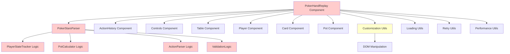
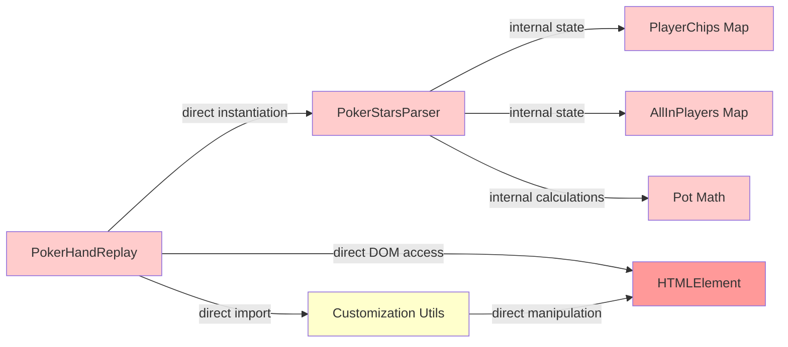
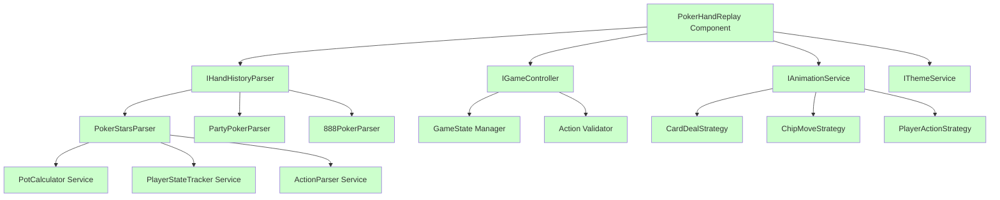
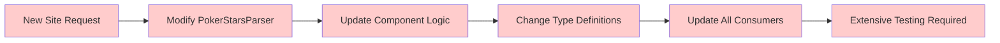

# Current Architecture Diagram

## Component Relationship Overview

## SOLID Violations Map

### 🔴 Critical SRP Violations
- **PokerHandReplay Component**: UI + Business Logic + Game Control + Animation
- **PokerStarsParser**: Parsing + State Management + Pot Calculation + Validation
- **Customization Utils**: Theme + Size + Animation + DOM Manipulation

### 🟡 Medium OCP Violations  
- **Parser Architecture**: No abstraction for different poker sites
- **Animation System**: Hardcoded animation logic in components

### 🟠 ISP Violations
- **ReplayConfig Interface**: 11 mixed-concern properties
- **PokerHand Interface**: Large interface with multiple concerns

### 🔴 DIP Violations
- **Direct DOM Dependencies**: Components directly manipulate DOM
- **Parser Instantiation**: Components directly create parser instances

## Dependency Flow Analysis

## Proposed Improved Architecture

## File Size and Complexity Metrics

| File | Lines | Methods | Responsibilities | Violation Level |
|------|-------|---------|------------------|-----------------|
| PokerStarsParser.ts | 920 | 36 | 6 | 🔴 Critical |
| PokerHandReplay.tsx | 602 | ~20 | 6 | 🔴 Critical |
| customization.ts | 370 | ~15 | 5 | 🟡 Medium |
| loading.ts | ~200 | ~10 | 3 | 🟡 Medium |
| types/index.ts | ~500 | N/A | Interface definitions | 🟠 ISP Issues |

## Change Impact Analysis

### Current: Adding New Poker Site

### Proposed: Adding New Poker Site

---

*Generated as part of SOLID principles analysis*
*See solid-analysis.md for detailed findings and recommendations*